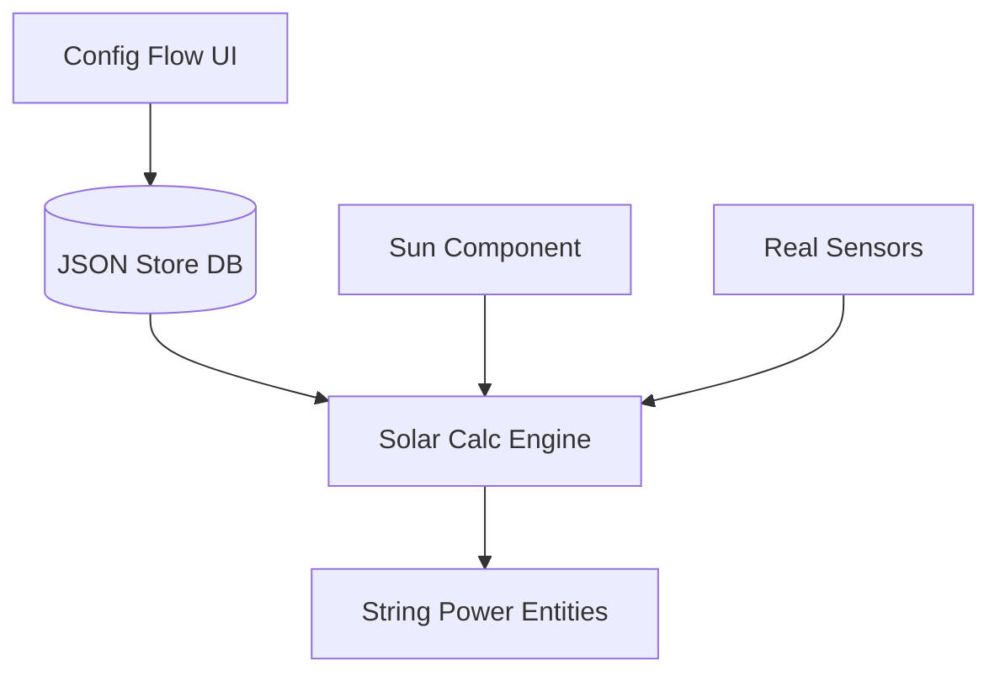

# ☀️ Accurate Solar Forecast for Home Assistant

**Accurate Solar Forecast** es una integración personalizada para Home Assistant diseñada para estimar la producción fotovoltaica con alta precisión física y geométrica.

A diferencia de las estimaciones simples, este componente utiliza **motores de transposición de irradiancia**, permitiendo simular múltiples strings con diferentes orientaciones utilizando **un único sensor de referencia** (piranómetro o sensor solar).

## ✨ Características Principales

### 📐 Motor de Transposición Geométrica

Olvídate de comprar múltiples sensores de irradiancia.

* Calcula la radiación incidente en cualquier superficie (orientación/inclinación).
* Utiliza la posición solar en tiempo real (Azimut y Elevación) para calcular el **Ángulo de Incidencia (AOI)**.
* **Gestión Geométrica Completa:** Configura la orientación e inclinación tanto de tus paneles como de tus sensores de referencia (ej: una estación meteorológica horizontal o un sensor en el tejado).

### ⚙️ Arquitectura Modular (v1.3.0)

El sistema ha sido completamente refactorizado para separar la persistencia de datos del motor de cálculo:

* **`core/` (El Cerebro):** Motores de transposición solar y lógica de sensores.
* **`databases/` (La Memoria):** Motor JSON basado en Home Assistant Store para persistencia de paneles y roofs.
* **`config_flow/` (La Interfaz):** Sistema de sub-entradas tipo "pill" para una gestión dinámica.

### 💾 Base de Datos de Paneles (PV Database)

Sistema de gestión de inventario integrado.

* **Define una vez, usa siempre:** Crea modelos de tus placas solares (Potencia, Coeficientes, NOCT, Voc, Isc, Vmp, Imp) y guárdalos en la base de datos interna.
* **Reutilizable:** Asigna el mismo modelo de panel a diferentes strings sin volver a introducir fichas técnicas.

---

## 🚀 Instalación

### Opción 1: HACS (Recomendado)

1. Añade este repositorio como **Custom Repository** en HACS.
2. Busca "Accurate Solar Forecast" e instala.
3. Reinicia Home Assistant.

### Opción 2: Manual

1. Descarga la carpeta `custom_components/accurate_solar_forecast`.
2. Cópiala dentro de `config/custom_components/` en tu instalación de HA.
3. Reinicia Home Assistant.

---

## 📖 Uso y Configuración

Ve a **Ajustes** > **Dispositivos y Servicios** > **Añadir Integración** > **Accurate Solar Forecast**.

Verás un nuevo menú principal estructurado en tres secciones:

### 1. 🏭 Configurar Módulos Fotovoltaicos (PV Models)

Aquí gestionas tu "inventario" de paneles.

* **Crear Nuevo Módulo:** Introduce la ficha técnica de tu panel.
* **Editar Módulo Existente:** Modifica datos si te equivocaste.
* **Eliminar Módulo:** Borra modelos que ya no necesites.

### 2. 🌡️ Configurar Sensores

Define tus estaciones meteorológicas o grupos de sensores.

* **Crear Grupo de Sensores:** Selecciona tus sensores de irradiancia y temperatura. Define también la **Inclinación y Orientación** física de tu sensor de irradiancia. Esto crea un nuevo Dispositivo en Home Assistant.
* **Editar Grupo de Sensores:** Modifica una configuración existente.

*Nota: Para eliminar un Grupo de Sensores, bórralo directamente desde la vista de integraciones de Home Assistant.*

### 3. ☀️ Configurar Strings

Aquí creas tus arrays solares virtuales.

* **Crear Nuevo String:**
    1. Selecciona qué **Grupo de Sensores** alimenta este string.
    2. Selecciona el **Módulo FV** (Marca/Modelo) de tu base de datos.
    3. Define la **Geometría del Panel** (Tilt/Azimut) y el número de paneles.

*Resultado:* Se creará una entidad String que simula la producción. *Nota: Para eliminar un String, bórralo directamente desde la vista de integraciones de Home Assistant.*

---

## 🧠 Cómo funciona (La Ciencia)

El componente realiza los siguientes cálculos en cada actualización:

1. **Geometría Solar:** Obtiene la posición del sol (`sun.sun`).
2. **Cálculo AOI:** Determina el ángulo de incidencia solar tanto para el **sensor de referencia** (definido en el Grupo de Sensores) como para el **panel objetivo** (definido en el String).
3. **Factor Geométrico:** Transpone la irradiancia medida a la superficie del panel:
    `Irradiancia_Target = Irradiancia_Ref * (cos(θ_target) / cos(θ_ref))`
4. **Modelo Térmico:** Calcula la temperatura de la célula ($T_{cell}$) basándose en los datos del Grupo de Sensores.
5. **Potencia Final:** Aplica el coeficiente de pérdidas por temperatura (Gamma) a la potencia base generada.

---

## 📄 Licencia

PolyForm Strict License 1.0.0 ->
<https://polyformproject.org/licenses/strict/1.0.0>
