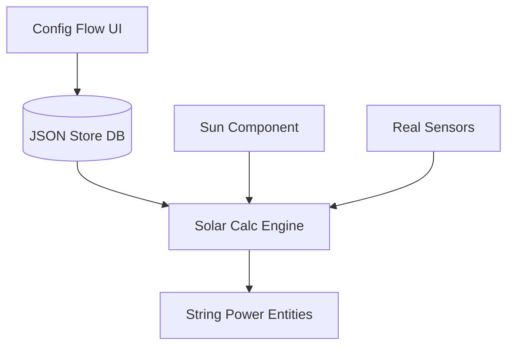

# ☀️ Accurate Solar Forecast for Home Assistant

**Accurate Solar Forecast** is a custom integration for Home Assistant designed to estimate photovoltaic production with high physical and geometric precision.

Unlike simple estimations, this component uses **irradiance transposition engines**, allowing you to simulate multiple strings with different orientations using **a single reference sensor** (pyranometer or solar sensor).

## ✨ Key Features

### 📐 Geometric Transposition Engine

Forget about buying multiple irradiance sensors.

* Calculates incident radiation on any surface (orientation/tilt).
* Uses real-time solar position (Azimuth and Elevation) to calculate the **Angle of Incidence (AOI)**.
* **Full Geometric Management:** Configure the orientation and tilt of both your panels and your reference sensors (e.g., a horizontal weather station or a rooftop sensor).

### ⚙️ Modular Architecture (v1.3.2)

The system has been completely refactored to separate data persistence from the calculation engine:

* **`core/` (The Brain):** Solar transposition engines and sensor logic.
* **`databases/` (The Memory):** JSON engine based on Home Assistant Store for panel and roof persistence.
* **`config_flow/` (The UI):** "Pill" type sub-entry system for dynamic management.

### 💾 PV Database (Solar Panels)

Integrated inventory management system.

* **Define once, use always:** Create models for your solar panels (Power, Coefficients, NOCT, Voc, Isc, Vmp, Imp) and save them in the internal database.
* **Reusable:** Assign the same panel model to different strings without re-entering technical specifications.

---

## 🚀 Installation

### Option 1: HACS (Recommended)

1. Add this repository as a **Custom Repository** in HACS.
2. Search for "Accurate Solar Forecast" and install.
3. Restart Home Assistant.

### Option 2: Manual

1. Download the `custom_components/accurate_solar_forecast` folder.
2. Copy it into `config/custom_components/` in your HA installation.
3. Restart Home Assistant.

---

## 📖 Usage and Configuration

Go to **Settings** > **Devices & Services** > **Add Integration** > **Accurate Solar Forecast**.

You will see a new main menu structured into three sections:

### 1. 🏭 Configure PV Modules (PV Models)

Manage your panel "inventory" here.

* **Create New Module:** Enter the technical specifications of your panel.
* **Edit Existing Module:** Modify data if needed.
* **Delete Module:** Remove models you no longer need.

### 2. 🌡️ Configure Sensors

Define your weather stations or sensor groups.

* **Create Sensor Group:** Select your irradiance and temperature sensors. Also define the physical **Tilt and Orientation** of your irradiance sensor. This creates a new Device in Home Assistant.
* **Edit Sensor Group:** Modify an existing configuration.

*Note: To delete a Sensor Group, remove it directly from the Home Assistant integrations view.*

### 3. ☀️ Configure Strings

Create your virtual solar arrays here.

* **Create New String:**
    1. Select which **Sensor Group** feeds this string.
    2. Select the **PV Module** (Brand/Model) from your database.
    3. Define the **Panel Geometry** (Tilt/Azimuth) and the number of panels.

*Result:* A String entity will be created to simulate production. *Note: To delete a String, remove it directly from the Home Assistant integrations view.*

---

## 🧠 How it works (The Science)

The component performs the following calculations in each update:

1. **Solar Geometry:** Obtains the solar position (`sun.sun`).
2. **AOI Calculation:** Determines the solar incidence angle for both the **reference sensor** (defined in the Sensor Group) and the **target panel** (defined in the String).
3. **Geometric Factor:** Transposes measured irradiance to the panel surface:
    `Target_Irradiance = Ref_Irradiance * (cos(θ_target) / cos(θ_ref))`
4. **Thermal Model:** Calculates cell temperature ($T_{cell}$) based on Sensor Group data.
5. **Final Power:** Applies the temperature loss coefficient (Gamma) to the base generated power.

---

## 📄 License

PolyForm Strict License 1.0.0 ->
<https://polyformproject.org/licenses/strict/1.0.0>
